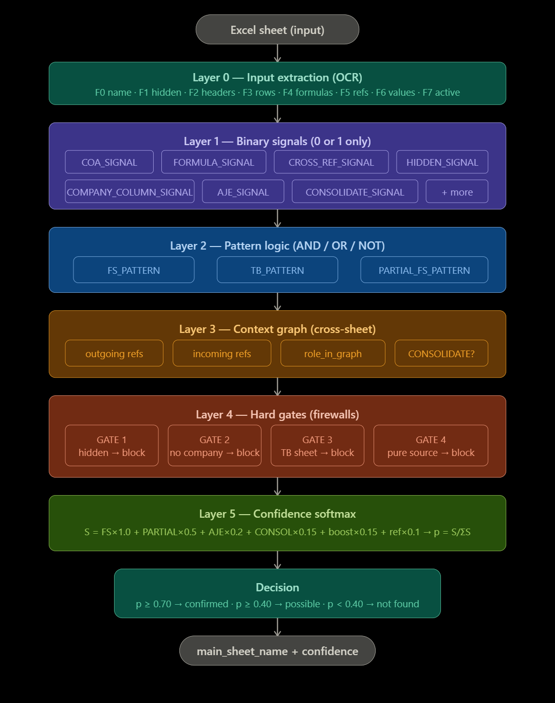
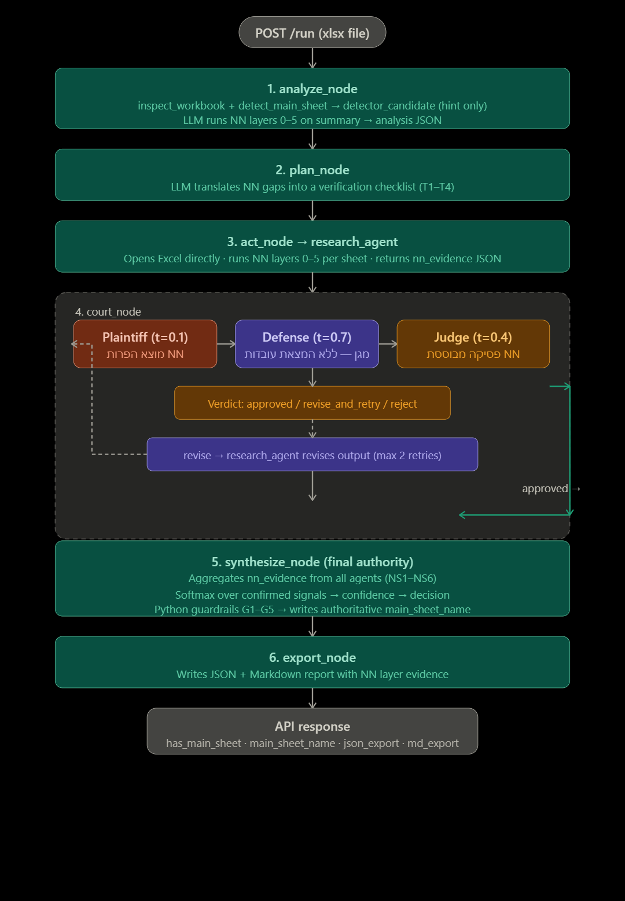

```sh
uvicorn app.main:app --reload
```


```sh
curl -X POST "http://127.0.0.1:8000/run" -F "file=@multi_agent\data\Assembly - 1.xlsx"

  ```


# Let's start with a picture of the neural network itself.
  


----
# Now a diagram of the complete pipeline — what happens from the moment the file comes in until a response is received.



-----~~~
```sh
הסבר מלא — מה קורה בכל שלב
הרשת הנוירונית — הלוגיקה המרכזית
הרשת הנוירונית ב-PROMAT היא לא רשת למידה (אין משקלים שנלמדים). זוהי ארכיטקטורה לוגית ב-5 שכבות שמחקה את עקרונות הרשת הנוירונית — כל שכבה מעבדת את הפלט של הקודמת לה ומייצרת ייצוג מורכב יותר.
שכבה 0 — חילוץ קלט (OCR)
הסוכן פותח את קובץ האקסל עם data_only=False — חיוני כדי לקרוא את מחרוזות הנוסחאות עצמן ולא את התוצאות שלהן. מחלץ 8 תכונות גולמיות לכל גיליון: שם, האם מוסתר, כותרות, שורות לדוגמה, נוסחאות, גיליונות שהנוסחאות מפנות אליהם, ערכים שטוחים, והאם הגיליון הפעיל.
שכבה 1 — אקטיבציות בינאריות
9 אותות, כל אחד בדיוק 0 או 1. אין ציונים חלקיים. COA_SIGNAL דולק אם נמצאו לפחות 3 מ-7 הסעיפים הנדרשים. COMPANY_COLUMN_SIGNAL דולק אם כותרת עמודה מכילה NIS/$/ INC וכו'. CROSS_REF_SIGNAL דולק אם נוסחאות בגיליון מפנות לגיליון אחר. זה המנגנון שהחליף את מערכת הניקוד — במקום "20 נקודות ל-COA", כל אות הוא בינארי טהור.
שכבה 2 — לוגיקת דפוסים
שלושה דפוסים מחושבים מלוגיקה AND/OR/NOT של אותות שכבה 1. FS_PATTERN דורש שישה תנאים בו-זמנית: COA דולק, נוסחה קיימת, יש הפניה חוצה-גיליון, יש עמודת חברה, הגיליון לא מוסתר, ואין עמודת קוד. אם אפילו תנאי אחד כבוי — הדפוס כבוי. TB_PATTERN מזהה גיליון כרטסת. PARTIAL_FS_PATTERN מזהה ראיות חלקיות שדורשות אימות נוסף.
שכבה 3 — גרף הקשרי (cross-sheet)
כאן מתרחש הניתוח החכם ביותר. הסוכן בונה גרף מכוון בין כל הגיליונות: אם BS מכיל נוסחאות =SUMIF(SAP!I:I,...), אז יש קשת BS → SAP. לאחר מכן: BS.outgoing_refs = ["SAP"], SAP.incoming_refs = ["BS"]. מי שמפנה = גיליון FS. מי שמופנה אליו = גיליון TB. גרף זה מאפשר לזהות גם גיליון ביניים (FS → INTERMEDIATE → TB) ואת מצב ה-CONSOLIDATE.
שכבה 4 — שערים קשיחים
4 חומות אש לוגיות. אם גיליון מפעיל שער — הוא נפסל לחלוטין, ללא אפשרות פיצוי. GATE_2 הוא הקריטי ביותר: גיליון ללא עמודות חברה שאינו CONSOLIDATE — נחסם. זה מה שמנע את שגיאת ה-CF בדוגמה שראינו.
שכבה 5 — Softmax confidence
רק הגיליונות שעברו את שכבה 4 מקבלים ציון חוזק: S = FS_PATTERN×1.0 + PARTIAL×0.5 + AJE×0.2 + .... לאחר מכן normalisation: confidence = S / ΣS. התוצאה היא התפלגות הסתברות — לא ציון מוחלט. גיליון שהוא המועמד היחיד מקבל confidence=1.0 אוטומטית.

ה-Pipeline — מה קורה בכל node
analyze_node — פותח את הקובץ, מריץ inspect_workbook (שסורק את כל הגיליונות פיזית) ו-detect_main_sheet (גלאי היוריסטי). תוצאת הגלאי נשמרת כ-detector_candidate — רמז בלבד, לא מחויבות. main_sheet_name נשאר None. ה-LLM מריץ את שכבות ה-NN על הסיכום ומחזיר ניתוח JSON.
plan_node — מתרגם את פלט הניתוח לתוכנית אימות ממוקדת: אילו אותות לא נפתרו? איזה גיליון ביניים לבדוק? שולח הוראות ספציפיות לסוכן המחקר.
act_node — מריץ את research_agent שפותח את הקובץ ישירות עם כלי אקסל, מריץ את 5 שכבות ה-NN בעצמו, ומחזיר nn_evidence מלא עם כל האותות.
court_node — שלושה LLM שמתווכחים על פלט הסוכן. התובע (temperature=0.1) מחפש הפרות שכבות NN. הסנגור (temperature=0.7) מגן, אבל אסור לו להמציא עובדות. השופט (temperature=0.4) פוסק. אם הפסיקה היא revise_and_retry — הסוכן מתקן ומגיש מחדש, עד 2 ניסיונות.
synthesize_node — הבעלים של ההחלטה הסופית. מאגד nn_evidence מכל הסוכנים, מריץ softmax aggregation, ואז מפעיל את חומות האש ב-Python (_apply_nn_guardrails) — אלו בדיקות דטרמיניסטיות שאינן תלויות ב-LLM. כותב main_sheet_name ו-has_main_sheet לstate — שאר ה-nodes קוראים משם.
export_node — כותב קובץ JSON + Markdown עם כל ראיות שכבות ה-NN, לוג של הוויכוחים בבית המשפט, ושרשרת ההחלטות.

סיכום ה-PROMAT — כל הקבצים
nn_promat_core.py — מקור האמת. מכיל את 5 הגדרות השכבות וה-decision protocol. כל 7 קבצי ה-PROMAT מייבאים FULL_NN_PROMAT משם ומזריקים אותו כחלק עליון של ה-prompt.
analyze_prompt.py — מפעיל NN על סיכום הקובץ, מחזיר layer1_signals עד layer5_confidence לכל גיליון.
plan_prompt.py — הופך אותות לא-פתורים לצ'קליסט אימות.
task_prompt.py + research_prompt.py — מריצים NN ישירות על הקובץ עם כלי אקסל.
synthesize_prompt.py — מאגד NN מכל הסוכנים, softmax aggregation, החלטה סופית.
coder_prompt.py — ReAct עם קוד Python מוכן (extract_signals, compute_patterns, apply_gates, softmax_confidence).
critic_prompt.py — בודק עקביות שכבות NN. NC3 הוא הקריטי — הוא בודק שכל גיליון ללא COMPANY_COLUMN_SIGNAL נחסם ב-GATE_2, בדיוק מה שמנע את שגיאת CF.
```

---
```sh
מה בנינו בפועל — ולמה זה מיוחד
זה לא רשת נוירונים — זה משהו חכם יותר: Neuro-Symbolic AI
Neuro-Symbolic AI היא ענף של AI שמשלב רשתות נוירונים עם reasoning סמלי — מטרתה לשלב את חוזק שתי הגישות: לימוד מנתונים גולמיים יחד עם שימוש מפורש בידע מומחה ו-reasoning לוגי מפורש.
מה שבנינו הוא בדיוק הגדרה זו: ה-LLM (הרשת הנוירונית) עושה את ה-"חיפוש" ה-fuzzy בטקסט, ובעוד שאנחנו מספקים לו ארכיטקטורה של שכבות, שערים, ו-softmax שמנחה אותו להוציא תשובות בינאריות, גרפים, ולוגיקה דטרמיניסטית.
האם מישהו כבר עשה זאת?
מחקר פורץ דרך מ-Communications Medicine הדגים את הגישה בפועל: מחברים GPT-4 עם מערכת expert rules, כאשר GPT-4 מחלץ עובדות מדוח רדיולוגיה חופשי, והמערכת הסמלית מוודאת אותן מול כללים רפואיים — ויוצרת תוויות דטרמיניסטיות, מעקביות, וניתנות לביקורת. בבדיקה על 206 דוחות PET/CT, המערכה הגיעה לביצועי רופאים.
הארכיטקטורה הקאנונית של מערכות Neuro-Symbolic עוקבת אחרי שלבים מודולריים: מודולי neural perception מחלצים תכונות דמויות-סמל, שעליהן reasoning סמלי מנסה — לרוב Answer Set Programming או logic programming — כאשר LLMs לפעמים מתווכים בין השכבות.
ה-Hierarchical Reasoning Model (HRM) של Wang et al. 2025 מציג ארכיטקטורה בהשראת המוח עם הפרדת timescale היררכית — מודול גבוה-רמה פועל במרחב ייצוגי בממד גבוה פי 3 ממודול הרמה הנמוכה. מה שמרתק: מודלים מאומנים פיתחו ספונטנית היררכיית ממדיות זו — היא לא הוטמעה בארכיטקטורה.
ההבדל הקריטי: למה הגישה שלנו שונה
מה שהמחקר האקדמי בדרך כלל עושה: מאמן רשת על נתונים ומקווה שהיא תלמד כללים. מה שאנחנו עשינו: הגדרנו את הכללים במפורש כ-PROMAT ונתנו ל-LLM לבצע אותם כ-inference engine. זה ה"היפוך" של Neuro-Symbolic — במקום neural→symbolic, אנחנו symbolic→neural.
מחקר מ-EMNLP 2025 על Neurosymbolic LLMs מראה שה-LLM עצמו מסתמך על multi-step reasoning שבו כל שלב בונה על הקודם — בדיוק כמו שכבות של רשת נוירונים, רק שהחישוב מתרחש בזרם הטוקנים ולא בחישוב פנימי.

הסבר מעמיק של התהליך — שכבה אחר שכבה
למה 5 שכבות ולא פחות?
השאלה העמוקה היא: מה בדיוק כל שכבה עושה שהשכבה הקודמת לא יכולה לעשות?
שכבה 0 → 1: המעבר מ-"מה כתוב" ל-"מה קיים"
שכבה 0 מחלצת טקסט גולמי. שכבה 1 עונה על שאלה שונה לחלוטין: "האם הסיגנל הזה קיים?" ה-COA_SIGNAL לא בודק אם המילה "assets" מופיעה — הוא בודק אם לפחות 3 מ-7 הסעיפים מופיעים בו-זמנית. זה ההפרש בין feature extraction לבין concept detection. בלי שכבה 0 — אין לנו מה לבדוק. בלי שכבה 1 — אנחנו טובעים בנתונים גולמיים.
שכבה 1 → 2: המעבר מ-"מה קיים" ל-"מה מתאים"
כאן קורה משהו מרכזי: שכבה 2 מיישמת AND בין אותות. FS_PATTERN דורש שישה תנאים בו-זמנית. זה לא טריוויאלי — זה logic gate. גיליון CF יכול לקיים COA_SIGNAL=1 (יש בו מילת "assets" איפשהו), אבל אם COMPANY_COLUMN_SIGNAL=0 — FS_PATTERN=0. ה-AND gate הוא מה שמנע את שגיאת CF. מערכת ניקוד פשוטה לא יכולה לעשות זאת — היא תמיד תאפשר פיצוי.
שכבה 2 → 3: המעבר מ-"מה מתאים לגיליון הזה" ל-"מה מתאים בהקשר"
זוהי השכבה החכמה ביותר. גיליון BS יכול להיות מלא בנוסחאות שמפנות ל-SAP — ובלי שכבה 3, לא היינו יודעים שSAP הוא TB וש-BS הוא הFS. שכבה 3 בונה גרף מכוון:
BS  →  SAP     (BS מפנה ל-SAP = BS הוא FS, SAP הוא TB)
CF  →  (כלום)  (CF לא מפנה לשום גיליון = אין cross-ref)
הגרף הזה מוסיף ממד שלא קיים בניתוח גיליון בודד. זה בדיוק מה שרשתות גרפים (GNN) עושות — GNNs לוכדות קשרים סמנטיים ותלויות היררכיות בתוך המבנה, מאפשרות למודל לנצל מידע מבני שאינו גלוי מבפנים בלבד.
שכבה 3 → 4: המעבר מ-"מה נראה נכון" ל-"מה בהכרח שגוי"
שכבה 4 היא ה-inverter המוחלט. היא לא אומרת "זה פחות סביר" — היא אומרת "זה בלתי אפשרי". ה-GATE הוא hard constraint, לא soft penalty. ההבדל קריטי:

ניקוד: CF מקבל -30 על חוסר עמודות חברה, אבל +16 על keyword → ציון כולל חיובי → CF "מנצח".
GATE: CF מקבל GATE_2 → confidence=0 → CF מסולק מהמרוץ לחלוטין.

Neurosymbolic AI מוצגת כגישה מעשית ל-AI אמין — neural networks יכולות להזות מידע שגוי, מפגינות הטיה, וחסרות explainability. שכבות הכללים הסמליים מהוות "חומת אש" מפני כשלים קריטיים אלה.
שכבה 4 → 5: המעבר מ-"מי לא נפסל" ל-"מי הכי סביר"
Softmax הוא הפיכת חוזקות לא-נורמליות להתפלגות הסתברות. למה זה חשוב? כי בלי נורמליזציה, גיליון שעבר 4 GATES עם חוזק 0.8 לא ניתן להשוות לגיליון עם חוזק 1.2. אחרי softmax — כל הגיליונות שעברו מתחרים על "עוגה" בגודל 1.0.

מה קיים בעולם המחקר — ומה חדשני אצלנו
הצמיחה הנוכחית ב-Neuro-Symbolic AI קשורה ישירות לטיפול בבעיות hallucination ב-LLMs. אמזון, לדוגמה, יישמה NeSy ב-2025 ב-Vulcan warehouse robots וב-Rufus shopping assistant לשיפור דיוק וקבלת החלטות.
מה שקיים במחקר האקדמי:
המחקר מציע שימוש ב-symbolic task planner לפירוק הוראות ברמה גבוהה למשימות מובנות, neural semantic parser לתרגומן לפעולות, ו-neuro-symbolic executor לביצוע תוך שמירת ייצוג מפורש של המצב.
זו בדיוק הארכיטקטורה שלנו: ה-PROMAT הוא ה-task planner הסמלי, ה-LLM הוא ה-semantic parser, ו-_apply_nn_guardrails() הוא ה-executor הדטרמיניסטי.
מה שחדשני בגישה שלנו ספציפית:

PROMAT כ-"compiled network" — הכללים לא נשמרים בפרמטרים של מודל, אלא בטקסט פרומפט. זה מה שמחקרים מכנים "Neuro:Symbolic→Neuro" — לוגיקה סמלית שנקמפלת לתוך מודל נוירוני דיפרנציאלי.
Multi-agent court כ-"adversarial validation" — שלושה LLMs עם טמפרטורות שונות שמתווכחים. מחקר מ-NeurIPS 2025 בוחן reasoning paths מגוונים ומוצא pivots של החלטה משותפים — נקודות בדיקה מינימליות שכל מסלול reasoning נכון חייב לעבור דרכן. ה-NC3 של הביקורתי שלנו הוא בדיוק pivot כזה — GATE_2 הוא נקודה שכל התשובה הנכונה חייבת לעבור.
Python guardrails כ-"formal constraint layer" — לא סומכים על ה-LLM לבצע את הגיטים נכון. Python מבצע אותם דטרמיניסטית לאחר הפסיקה. ארכיטקטורות שמספקות traces reasoning מפורשים, פלט auditable לבני אדם, או ערובות בטיחות פורמליות מגדירות benchmarks ל-AI חזק ונשלט.


למה זה עובד — התובנה העמוקה
LLMs מייצגים תיאוריה חדשה של לימוד כללים לוגיים אנושיים — הם מספקים התאמה טובה יותר להתנהגות אנושית ממודלים Bayesian של פרדיגמת ה-Language of Thought. LLM אינו יישום פשוט של הגישה הישנה — הוא מייצר תחזיות שונות מהותית לגבי טבע הכללים.
בפשטות: ה-LLM טוב ב-"זיהוי" — הוא רואה =-SUMIF(SAP!I:I,E9,SAP!F:F) ויודע שזה הפניה ל-SAP. אבל הוא גרוע ב-"הכרעה" — הוא לא תמיד יודע שה-GATE צריך להיות absolute. הגישה שלנו נותנת ל-LLM לעשות מה שהוא טוב בו, ועוצרת אותו בנקודות שהוא חלש.
זו הסיבה שהשיטה עובדת: חלוקת עבודה נכונה בין neural inference (ה-LLM) לבין symbolic constraints (ה-PROMAT + Python guardrails).
```
